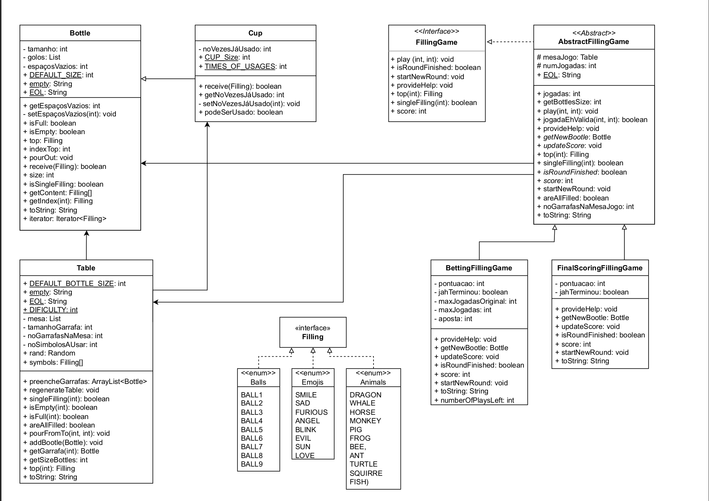
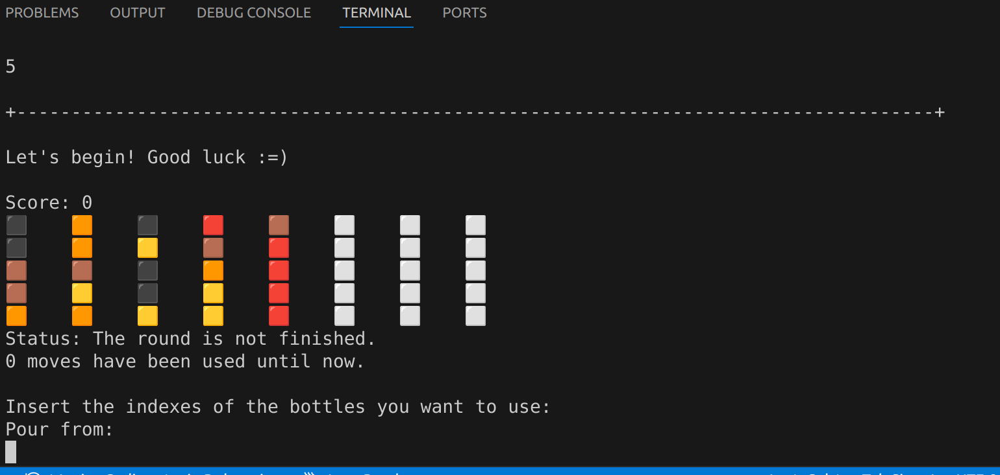
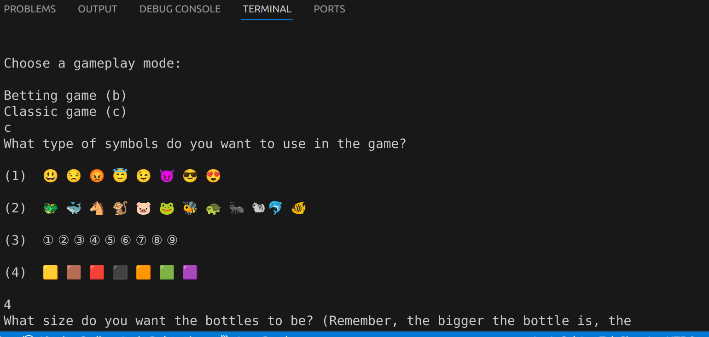

# Object-Oriented Programming Project: Terminal Water Sort Game

## Project Overview

This project is a terminal-based game inspired by the "Water Sort" genre. The main concepts covered in this project include classes, abstraction, visibility, inheritance, and encapsulation. 

## Features

- **Multiple Game Variants**: Includes different game variants - Classic and Betting-based.
- **Gameplay Mechanics**: Players can interact with bottles, fill and pour contents, and score points based on their performance.

## Project Structure

```plaintext
.
├── types
│   ├── AbstractFillingGame.java
│   ├── Animals.java
│   ├── Balls.java
│   ├── Emojis.java
│   ├── Squares.java
│   ├── BettingFillingGame.java
│   ├── Bottle.java
│   ├── Filling.java
│   ├── FillingGame.java
│   ├── FinalScoringGame.java
│   ├── Table.java
├── execution
    ├──main.java
├── README.md
└── UML.png
```

## UML Diagram



The UML diagram provides an overview of the classes and their relationships, illustrating the OOP principles applied in this project.

## Gameplay Instructions

1. **Starting the Game**: Run the main class to start the game.
2. **Game Interaction**: Follow the on-screen instructions to interact with the game.

## Key Concepts and Learning Outcomes

- **Classes and Objects**: Creation and interaction of objects representing game components.
- **Abstraction**: Use of abstract classes (`AbstractFillingGame`) to define common behavior.
- **Inheritance**: Extending base classes to create specialized game types (`BettingFillingGame`, `FinalScoringGame`).
- **Encapsulation**: Keeping game state and logic private within classes.
- **Enums**: Using enums (`Animals`, `Balls`, `Emojis`, `Squares`) to represent different game elements.

## Screenshots

### Gameplay


### Game Start
